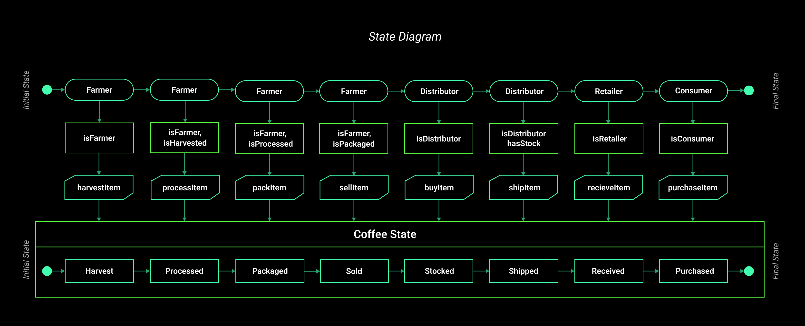
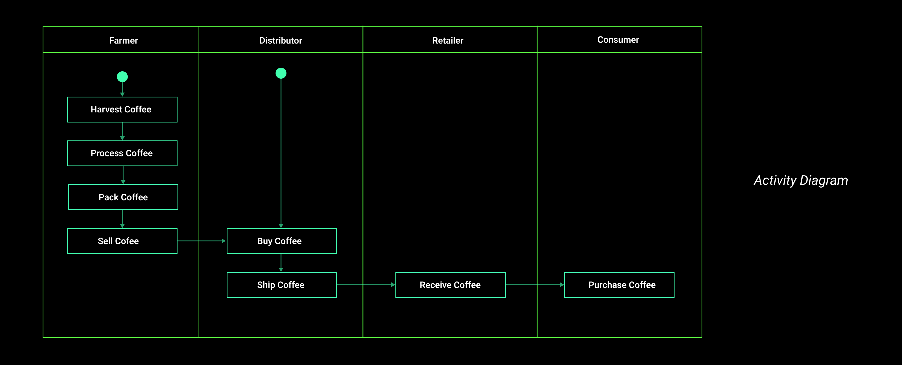
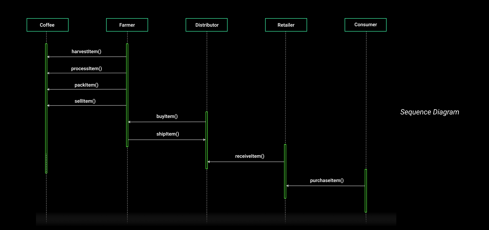
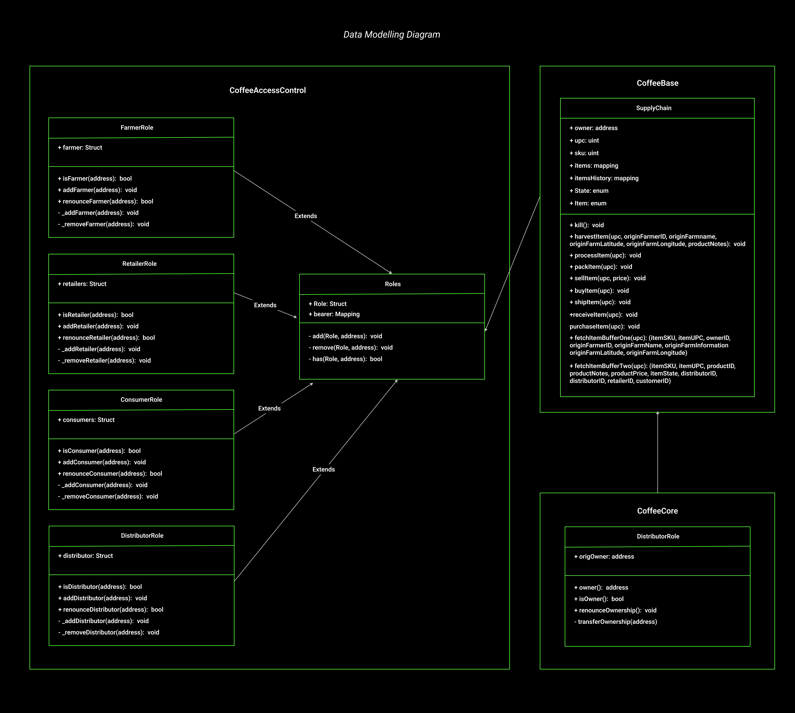

# About Project
This DApp demonstrates a Supply Chain flow between a Seller and Buyer. The user story is similar to any commonly used supply chain process. A Seller can add items to the inventory system stored in the blockchain. A Buyer can purchase such items from the inventory system. Additionally a Seller can mark an item as Shipped, and similarly a Buyer can mark an item as Received.

# UML Diagram

The UML Diagrams below shows the structure that represent the components of the  supplychain systems, the state changes, flow of activity and inetarctor between object/actors  in the system. The actors in the system are Farmers,  Distributors, Retailers and Consumers.

# Libraries

# IPFS